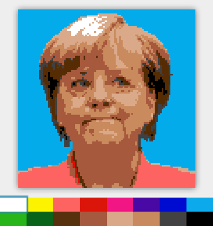

# Reddit r/Place application built with Spring Boot

## What r/Place is?

[This video](https://www.youtube.com/watch?v=0QO0yZldC2M) explains everything.

Technical posts:

* [How We Built r/Place](https://redditblog.com/2017/04/13/how-we-built-rplace/)
* [Looking Back at r/Place](https://redditblog.com/2017/04/18/place-part-two/)

Build-in-a-weekend post:

* [Building a r/place in a weekend](https://josephg.com/blog/rplace-in-a-weekend/) by Seph ([Git repo](https://github.com/josephg/sephsplace.git))

## What this project is about?

It is about the same application built with help of Spring Boot, Vue and Kafka.

A bit simplified, without restriction on how many pixels you may place within time interval.

Deployable both from command line as Spring Boot applications and in Docker containers.



Enjoy!

# Prerequisites

To build and run the project, you need to have these installed:

* Java 1.8
* Gradle 4.2 (optional)
* Kafka (for local deployment only)
* Docker and Docker Compose (containers deployment only)

# How it works in ASCII

               F   R   O   N   T   E   N   D                               K  A  F  K  A             B  A  C  K  E  N  D
     __________                              __________                    _____________                  _________
    |          |---- WebSocket connect ---->|          ||                 |    pixel    |                | backend |
    |          |<----- image snapshot ------|          ||----- pixel ---->|    topic    |---- pixel ---->| Web app |----
    | frontend |                            | frontend ||     message     |_____________|    message     |_________|    |
    |    UI    |---------- REST API ------->| Web apps ||                  _____________                                |
    |          |     /pixel?x=0&y=1&c=2     |          ||<---- batch -----|    batch    |<------ batch message ---------
    |__________|<---- image change batch ---|__________||     message     |    topic    |
                                             |__________|                 |_____________|

# Modules description

* _place-common_ - common for back-end and front-end
* _place-backend_ - back-end Spring Boot application, which reads incoming messages from _pixel_ topic and them into image, producing snapshots for _batch_ topic
* _place-frontend_ - front-end Spring Boot application, which contains UI to represent image, provides REST entrypoint to submit pixel information to _pixel_ topic, consumes image snapshot messages from _batch_ topic.
* _place-tool_ - image transformation tool to format acceptable by Kafka console producer script. Don't you want to see Angela asap?

## Build the project

Execute from command line this:

```sh
$ gradle clean build
```

It compiles the projects, runs unit tests and produces JAR files for modules, then creates ZIP archives for _place-frontend_ and _place-backend_ modules and one for root project with Docker scripts:

```sh
$ find . -name '*.zip'
./build/distributions/place.zip
./place-backend/build/distributions/place-backend.zip
./place-frontend/build/distributions/place-frontend.zip
```

## Deploy project locally

Make sure you have ZooKeeper and Kafka up and running:

```sh
$ zookeeper-server-start.sh ../config/zookeeper.properties

# and in another console

$ kafka-server-start.sh ../config/server.properties
```

Then, create topic _pixel_, providing partitions count _10_:

```sh
$ kafka-topics.sh --create \
                  --zookeeper localhost:2181 \
                  --replication-factor 1 \
                  --partitions 10 \
                  --topic pixel
Created topic "pixel".
```

Describing topic gives 10 partitions (_0-9_): 

```sh
$ kafka-topics.sh --describe \
                  --topic pixel \
                  --zookeeper localhost:2181
Topic:pixel     PartitionCount:10       ReplicationFactor:1     Configs:
        Topic: pixel    Partition: 0    Leader: 0       Replicas: 0     Isr: 0
        Topic: pixel    Partition: 1    Leader: 0       Replicas: 0     Isr: 0
        Topic: pixel    Partition: 2    Leader: 0       Replicas: 0     Isr: 0
        Topic: pixel    Partition: 3    Leader: 0       Replicas: 0     Isr: 0
        Topic: pixel    Partition: 4    Leader: 0       Replicas: 0     Isr: 0
        Topic: pixel    Partition: 5    Leader: 0       Replicas: 0     Isr: 0
        Topic: pixel    Partition: 6    Leader: 0       Replicas: 0     Isr: 0
        Topic: pixel    Partition: 7    Leader: 0       Replicas: 0     Isr: 0
        Topic: pixel    Partition: 8    Leader: 0       Replicas: 0     Isr: 0
        Topic: pixel    Partition: 9    Leader: 0       Replicas: 0     Isr: 0
```

Similarly, create _batch_ topic for just a single partition: 

```sh
$ kafka-topics.sh --create \ 
                  --zookeeper localhost:2181 \
                  --replication-factor 1 \
                  --partitions 1 \
                  --topic batch
Created topic "batch".
```

Now, we can unzip and run our back-end and front-end:

```sh
$ unzip place-backend/build/distributions/place-backend.zip -d /tmp

$ /tmp/place-backend/bin/place-backend.sh

# and in another console

$ unzip place-frontend/build/distributions/place-frontend.zip -d /tmp

$ /tmp/place-frontend/bin/place-frontend.sh
```

Open Web browser page [http://localhost:8080/place](http://localhost:8080/place) and play!

Want to see Angela? Nothing can be easier than that. Just convert her image with help of _place-tool_ and produce pixels for the _pixel_ topic:

```sh
$ java -jar place-tool/build/libs/place-tool.jar \
       place-tool/src/main/resources/merkel.jpg \
       place-tool/src/main/resources/merkel.dump

$ kafka-console-producer.sh --broker-list localhost:9092 \
                            --topic pixel \
                            --property parse.key=true \
                            --property key.separator=/ \
                            <place-tool/src/main/resources/merkel.dump
```

Watch you browser page updating in segments!

## Deploy project in containers

Execute from command line this:

```sh
$ gradle clean build
```

It compiles the projects and creates _build/distributions/place.zip_ archive containing all files required to build and run containers:

```sh
$ unzip build/distributions/place.zip -d /tmp

$ cd /tmp/place

$ docker-compose build

$ docker-compose up
```

Open Web browser page [http://localhost:8080/place](http://localhost:8080/place) and play!

Want to see Angela? Nothing can be easier than that. Just convert her image with help of _place-tool_ and produce pixels for the _pixel_ topic:

```sh
$ java -jar place-tool/build/libs/place-tool.jar \
       place-tool/src/main/resources/merkel.jpg \
       place-tool/src/main/resources/merkel.dump

$ kafka-console-producer.sh --broker-list localhost:19092,localhost:29092 \
                            --topic pixel \
                            --property parse.key=true \
                            --property key.separator=/ \
                            <place-tool/src/main/resources/merkel.dump
```

Watch you browser page updating in segments!

## Just in case...

If you want to use REST API, submit pixels like this:

```sh
curl -X PUT 'http://localhost:8080/place/pixel?x=0&y=1&c=2'
```
